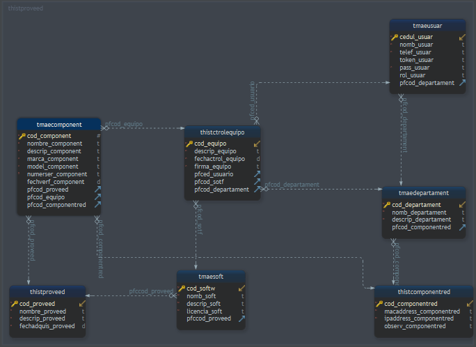

### Variables de entorno
**Crear el archivo .env con las siguientes variables**
```diff
DATABASE_URL= colocar el connectstring
API_PORT= colocar el puerto del servidor
TOKENKKEY= llave secreta para el token
````

## Diseño de la base de datos


### Palabras claves de las base de datos
|abreviatura | significado |
|------------|--------|
|tma|tabla maestra|
|thist|tabla historia|
|code |llave primaria|
|pfcode|llave foranea|

### Nombre de las tablas 
|nombre de la tbls|significados|
|-------------|----------------------------|
|tmaecomponent|tabla maestra de componentes de los equipos que se disponen|
|tmaesoft|tabla maestra de los software que se dispone|
|tmaeusuar|tabla maestra de usuario del sistema|
|tmaedepartament |tabla maestra de departamentos|
|thistproveed |tabla historica del proveedor de cada componente|
|thistctrolrequipo |tabla historica de control de equipo|
|thistcomponentred |tabla historica de componentes de red y sus configuraciones|

### Ruta de api general
> https://servergobernacion.herokuapp.com/

### Middleware
**Para generar el token se hace cuando te registras o al acceder al sistema**

|rutas          |mthd https|                 descripcion|     parametros / body      |
|---------------|----------|----------------------------|----------------------------|
|createUser     |post      | para crear un nuevo usuario| pass_usuar, cedul_usuar ,nomb_usuar, telef_usuar |
|loginUser      |post      | para acceder al sistema    | pass_usuar, cedul_usuar|


### Rutas
**Las rutas que nceesiten el middleware(si) pasar el token por el header o body nombre de la variable 'token'**

>La ruta saveReport la parametro componentes debe ser envia en un array junto de un json para que la funcion procedure de psql ejecute siguiente ejemplo

```js

"componentes":[
  {
    "descrip_component": "monitor",
    "marca_component": "smox4",
    "model_component": "moni",
    "numerser_component": "412321SAD",
    "pfcod_proveed": 1,
    "pfcod_equipo": "00010"
  },
  {
    "descrip_component": "placa madre",
    "marca_component": "psc",
    "model_component": "sds",
    "numerser_component": "4122232D",
    "pfcod_proveed": 1,
    "pfcod_equipo": "00010"
  }
]
```

|rutas          |mthd https|                 descripcion|     parametros / body             | middleware       |
|---------------|----------|----------------------------|-----------------------------------|------------------|
|getInfoUser    |post      | obtener informaicion del usuario logueado          |           | si  |
|getUser        |get       | obtener una lista de usuarios                      |           |     |
|getVendors     |get       | obtener una lista de proveedores                   |           |     |
|getDepartament |get       | obtener todos los departamentos existentes         |           |     |
|getReport      |post      | obtener informacion general como nombre usuario, proveedor, departamento etc|cedul_usuar, cod_equipo |  |
|saveReport     |post      | guardar el informe total   |cod_equipo,descrip_equipo,fechactrol_equipo,firma_equipo pfced_usuario, pfcod_departament, componentes,pfcod_proveed,nomb_soft,descrip_soft licencia_soft ||                                                                                                             