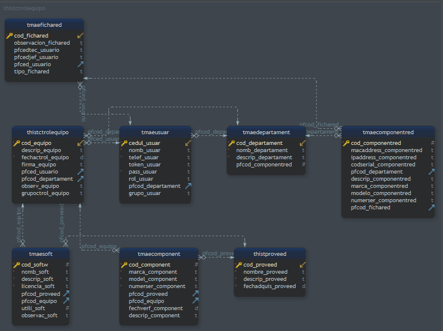

### Variables de entorno
**Crear el archivo .env con las siguientes variables**
- DATABASE_URL= **"colocar el connectstring"**
- API_PORT= **"colocar el puerto del servidor"**
- TOKENKKEY= **"llave secreta para el token"**

## Diseño de la base de datos

### Palabras claves de las base de datos
|abreviatura | significado |
|------------|--------|
|tma|tabla maestra|
|thist|tabla historia|
|code |llave primaria|
|pfcode|llave foranea|

### Nombre de las tablas 
|nombre de la tbls|significados|
|-------------|----------------------------|
|tmaecomponent|tabla maestra de componentes de los equipos que se disponen|
|tmaesoft|tabla maestra de los software que se dispone|
|tmaeusuar|tabla maestra de usuario del sistema|
|tmaedepartament |tabla maestra de departamentos|
|thistproveed |tabla historica del proveedor de cada componente|
|thistctrolrequipo |tabla historica de control de equipo|
|thistcomponentred |tabla historica de componentes de red y sus configuraciones|

### Middleware
**Para generar el token se hace cuando te registras o al acceder al sistema**

|rutas          |mthd https|                 descripcion|     parametros / body      |
|---------------|----------|----------------------------|----------------------------|
|createUser     |post      | para crear un nuevo usuario| pass_usuar, cedul_usuar ,nomb_usuar, telef_usuar |
|loginUser      |post      | para acceder al sistema    | pass_usuar, cedul_usuar|

### Rutas
**Las rutas que nceesiten el middleware(si) pasar el token por el header o body nombre de la variable 'token'**

|rutas          |mthd https|                 descripcion|     parametros / body             | middleware       |
|---------------|----------|----------------------------|-----------------------------------|------------------|
|getGeneral     |get       | obtener informacion general como nombre usuario, proveedor, departamento etc|  |  |
|getUser        |get       | obtener una lista de usuarios                      |                           |  |
|getVendors     |get       | obtener una lista de proveedores|  |  |
|getDepartament |get       | obtener todos los departamentos existentes         |                           |  |
|getComponent   |get       | obtener todos las partes de los equipos disponibles|                           |  |
|insertComponent|post      | registrar una nueva parte de un equipo | nombre_component,descrip_component,marca_component,model_component,numerser_component| SI |
|insertCtrolequipo|post    | registrar una nuevo control de equipo | descrip_equipo,fechactrol_equipo,firma_equipo,pfced_usuario,pfcod_departament| SI |
